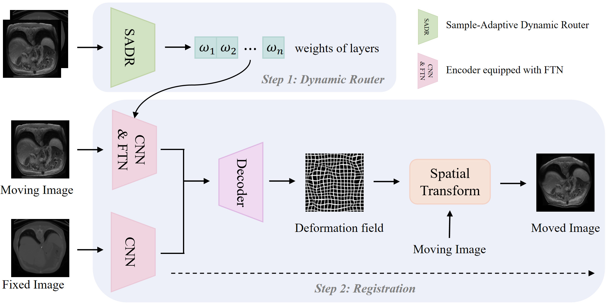

# FT-Reg: Unsupervised Deformable Multimodal Registration via Dynamic Feature Translation




FT-Reg a novel multimodal medical registration method based on feature translation. We propose a lightweight module called FTN, which enables effective domain alignment between different modalities at the feature stage. Compared to previous image translation approaches, our method achieves higher quality registrations. Additionally, we introduce a dynamic router that adaptively executes the feature translation based on the characteristics of diverse samples, which further enhances the adaptability and flexibility of the registration process.


## Data

The original Abdomen MR-CT dataset can be obtained from [Learn2Reg 2021](https://learn2reg.grand-challenge.org). Our preprocessed dataset will be publicly available.

## Environment

To set up the necessary environment for running FT-Reg, install the dependencies by executing:

```
pip install -r requirements.txt
python setup.py install
```

## Usage
### Training
#### 1) train the deformation network for the subsequent iterative training strategy:

```
python train_val_decoupling.py --img-list-1 /path/to/img-list-1 --img-list-2 /path/to/img-list-2 --model-dir /path/to/model-dir --pairs /path/to/pairs --img-prefix test --seg-prefix label
```

#### 2) train both the deformation network and the FTN, take the second feature layer for instance:

```
python test_joint_R_G_level2.py --img-list-1 /path/to/img-list-1 --img-list-2 /path/to/img-list-2 --pairs /path/to/pairs --img-prefix test --seg-prefix label --load-model /path/to/load-model 
```
#### 2) train the dynamic router:

```
python train_route_with_mi.py --img-list-1 /path/to/img-list-1 --img-list-2 /path/to/img-list-2 --pairs /path/to/pairs --img-prefix test --seg-prefix label   
```


## Acknowlegements

This code is inspired by [VoxelMorph](https://github.com/voxelmorph/voxelmorph).